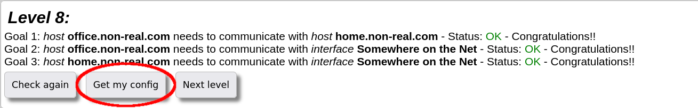
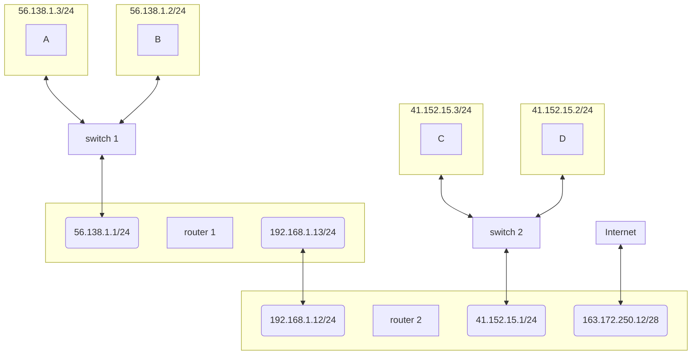

# NET-PRACTICE
*This project has been created as part of the 42 curriculum by `abetemps`*

- [📖 Description](#-description)
- [📜 Instructions](#-instructions)
   * [🖥️ Install and run the training interface](#-install-and-run-the-training-interface)
   * [⚙️ Export configurations](#-export-configurations)
   * [‼️ Submission requirements](#-submission-requirements)
- [📚 Resources](#-resources)
   * [🌐 TCP/IP Addressing](#-tcpip-addressing)
   * [🎯 Subnet Masks](#-subnet-masks)
      + [Bit‑level example](#bitlevel-example)
      + [Valid and invalid subnet masks](#valid-and-invalid-subnet-masks)
      + [CIDR representation](#cidr-representation)
   * [🧱 Classes (Historical)](#-classes-historical)
   * [🏠 Private IP Addresses](#-private-ip-addresses)
   * [🔀 Switches](#-switches)
   * [📡 Routers](#-routers)
   * [🚪 Default Gateways](#-default-gateways)
   * [🧩 OSI Layers](#-osi-layers)
- [📥 Submission details (`.json` files)](#-submission-details-json-files)

# 📖 Description

***
# 📜 Instructions

## 🖥️ Install and run the training interface
First of all, you will have to install and run the training interface.

The following command will **install** (download and extract) the interface's archive and then **start** the the server.
```
wget https://cdn.intra.42.fr/document/document/45519/net_practice.1.9.tgz && tar -xf net_practice.1.9.tgz && cd net_practice && ./run.sh
```

## ⚙️ Export configurations
Once a level is complete, you can **export your configuration** clicking the `Get my config` button.



It will allows you to download a `json` file, similar to [these ones](#-submission-details-json-files).

## ‼️ Submission requirements
Your submitted repository should contains:
- configuraton `json` files for each level (1 to 10)
- a README.md similar to this one

***
# 📚 Resources
## 🌐 TCP/IP Addressing

The network is a wide domain. In this section we explain some of the key concepts needed to understand it a bit better.

A brief explanation is that, to identify a device over a network (ex: Internet), we use what we call an **IP address** (Internet Protocol address). If you want to communicate with a server or another computer, this is basically what you will use to know **where** to send the data.

📬 **Analogy:**  
To send a postcard to your friend, you need to know their street address. In networking, to send data to another computer, you need to know its IP address.

There are different versions of IP, and the most commonly known / used are:

- **IPv4** (IP version 4).
- **IPv6** (IP version 6) – a newer version that solves IPv4 limitations, especially the **shortage of available addresses**.

In the following, we only explain **IPv4**.

An IPv4 address consists of four numbers separated by dots (`.`). For example, `192.168.1.24` could be the IP address of your computer.

An IPv4 address is **32 bits**. Each “number” (octet) is 8 bits:

- `192.168.1.24` → `11000000.10101000.00000001.00011000`

The **TCP/IP addressing scheme** is what allows you to identify a specific **network** or **host** with which to communicate. Each IP address is split into:

- **Network portion** – which network the device belongs to.
- **Host portion** – which specific device on that network.

This split is defined by the [**subnet mask**](#-subnet-masks).

> ℹ️ See:  
> - [What Is an IP Address?](https://learn.microsoft.com/en-us/troubleshoot/windows-client/networking/tcpip-addressing-and-subnetting) (learn.microsoft.com)  
> - [What is an IP Address? // You SUCK at Subnetting](https://www.youtube.com/watch?v=5WfiTHiU4x8) (youtube.com - NetworkChuck)
> - [screw it... let's rebuild the ENTIRE Internet](https://www.youtube.com/watch?v=HRa31C7zfzk) (youtube.com - V2F)
> - [What Is IPv4?](https://www.cloudflare.com/learning/network-layer/what-is-ipv4/) (cloudflare.com)


## 🎯 Subnet Masks

A **subnet mask** works together with the IP address. It also consists of 32 bits. In decimal form, it is represented with 4 numbers between 0 and 255 separated by a dot (`.`).

The subnet mask tells us **which part** of an IP address is the **network portion** and which part is the **host portion**.

🧠 **Key idea:**  
Each bit of the subnet mask “matches” a bit of the IP address:

- If the subnet mask bit is `1`, the corresponding IP bit belongs to the **network** part (must stay the same to remain in the same network).
- If the subnet mask bit is `0`, the corresponding IP bit belongs to the **host** part (can change to represent different hosts within the same network).

### Bit‑level example

Imagine the following:

- IP address : `192.168.1.10`
- Subnet mask : `255.255.255.0`

If we represent both in binary:

|              | 1st octet           | 2nd octet           | 3rd octet           | 4th octet           |
|--------------|---------------------|---------------------|---------------------|---------------------|
| 192.168.1.10 | 1 1 0 0 0 0 0 0     | 1 0 1 0 1 0 0 0     | 0 0 0 0 0 0 0 1     | 0 0 0 0 1 0 1 0     |
| 255.255.255.0| 1 1 1 1 1 1 1 1     | 1 1 1 1 1 1 1 1     | 1 1 1 1 1 1 1 1     | 0 0 0 0 0 0 0 0     |

The subnet mask has `1` bits in the **first three octets**, so these octets represent the **network portion**. That means:

- The range of IP addresses from `192.168.1.0` to `192.168.1.255` represents **one network** (192.168.1.0/24).
- `192.168.1.10` and `192.168.1.25` are two IP addresses of devices on the **same network**.
- If we change a value in the first three octets, we get a **different network** (for example, `192.168.5.10` and `192.168.1.11` are **not** on the same network with this mask).

### Valid and invalid subnet masks

If we represent a subnet mask in binary, it will always be:

> Some number of `1`s (possibly zero), followed by `0`s,  
> **never** arbitrarily alternating `1`s and `0`s.

✅ **Correct subnet masks** (examples):

| Octet 1                     | Octet 2                     | Octet 3                     | Octet 4                     |
|-----------------------------|-----------------------------|-----------------------------|-----------------------------|
| 1 1 1 1 1 1 1 1             | 1 1 1 1 1 1 1 1             | 1 1 1 1 0 0 0 0             | 0 0 0 0 0 0 0 0             |
| 1 1 1 1 1 1 1 1             | 1 1 1 1 1 1 1 1             | 1 1 1 1 1 1 1 1             | 0 0 0 0 0 0 0 0             |
| 1 1 1 1 1 1 1 1             | 1 1 1 1 1 1 1 1             | 1 1 1 1 1 1 1 1             | 1 1 0 0 0 0 0 0             |

❌ **Incorrect subnet masks** (examples):

| Octet 1                     | Octet 2                     | Octet 3                     | Octet 4                     |
|-----------------------------|-----------------------------|-----------------------------|-----------------------------|
| 1 1 1 1 1 1 1 1             | 1 1 0 0 0 0 1 0             | 1 1 1 1 0 0 0 0             | 0 0 0 0 1 0 0 0             |
| 0 0 0 0 0 1 1 1             | 1 1 1 1 1 1 1 1             | 1 1 1 1 1 1 1 1             | 0 0 0 0 0 0 0 0             |
| 1 1 1 1 1 1 1 1             | 1 0 1 1 1 1 1 1             | 1 1 0 1 1 1 1 1             | 1 1 0 0 0 0 0 0             |

### CIDR representation

A subnet mask can be represented by a `/` followed by the number of **leading `1`s** in the mask. For example, with:

- IP address : `192.168.1.10`
- Subnet mask : `255.255.255.0`

we can write the address as: `192.168.1.10/24`, because the subnet mask in binary begins with **24 ones** followed by **8 zeros**:

- `255.255.255.0` → `11111111.11111111.11111111.00000000` → `/24`

This is called **CIDR notation** (Classless Inter‑Domain Routing).

> ℹ️ See:  
> - [CIDR Notation and Subnet Masks](https://en.wikipedia.org/wiki/Classless_Inter-Domain_Routing) (wikipedia.org)  


## 🧱 Classes (Historical)

Historically, IPv4 networks used **classes** (classful addressing), but this is now considered **obsolete**. It looked like this:

| Class | Range                      | Default subnet mask |
|-------|----------------------------|---------------------|
| A     | 1.0.0.0 – 126.255.255.255  | 255.0.0.0           |
| B     | 128.0.0.0 – 191.255.255.255| 255.255.0.0         |
| C     | 192.0.0.0 – 223.255.255.255| 255.255.255.0       |
| D     | 224.0.0.0 – 239.255.255.255| (Multicast)         |
| E     | 240.0.0.0 – 255.255.255.255| (Experimental)      |

Class A network:

- 126 possible different networks.
- ~16 million possible IP addresses per network.

Class B network:

- 16 384 possible different networks.
- 65 536 possible IP addresses per network.

Class C network:

- 2 097 152 possible different networks.
- 256 possible IP addresses per network.

Class D: reserved for multicast.  
Class E: reserved for experimental uses.

Note that the range `127.0.0.0 – 127.255.255.255` is not listed. This range is reserved for **loopback** addresses (e.g. `127.0.0.1`), which refers to the **local machine** itself.

As you can see, for Class A there are very few networks and way too many hosts per network, so today we use **classless** addressing (CIDR), which is more flexible. Some traces of classes remain, like the reserved range for multicast.

A classless IP address could be something like: `46.25.165.23/255.255.255.0`. Here, the IP address falls in the old “Class A” numeric range, but we use a different subnet mask.

> ℹ️ See:  
> - [Classful Network](https://en.wikipedia.org/wiki/Classful_network) (wikipedia.org)


## 🏠 Private IP Addresses

For the current model to work, each **public** IP address on the Internet needs to be globally **unique**. If two different devices had the same public IP, we would not know to which one we should send data.

With IPv4, there are about **4.3 billion** different addresses. That sounds big, but it is not enough if every device on Earth had to have a unique public IP (phones, laptops, IoT devices, etc.).

To solve this, we use **private IP address ranges** together with **NAT (Network Address Translation)**.

Private IPv4 ranges (cannot be routed on the public Internet) are:

| Class | Range                           | Typical default mask |
|-------|----------------------------------|----------------------|
| A     | 10.0.0.0 – 10.255.255.255        | 255.0.0.0            |
| B     | 172.16.0.0 – 172.31.255.255      | 255.255.0.0          |
| C     | 192.168.0.0 – 192.168.255.255    | 255.255.255.0        |

Example of how this works in a home:

- Your ISP gives you **one** public IP (e.g. `203.0.113.14`).
- Your router/modem gives your devices private IPs (e.g. `192.168.1.10`, `192.168.1.20`, etc.).
- When your device wants to talk to the Internet, it sends the traffic to the router.
- Thanks to **NAT**, the router translates the internal private IPs into its single public IP, keeps track of the connections, and knows to which internal device to send each response.

> ℹ️ See:  
> - [Private Network](https://en.wikipedia.org/wiki/Private_network) (wikipedia.org)  
> - [What Is NAT?](https://www.cloudflare.com/learning/network-layer/what-is-nat/) (cloudflare.com)


## 🔀 Switches

Switches are **Layer 2** devices (see OSI layers below).

Imagine you have two computers in the same room and you want to send data from one to the other. You could connect them directly using an Ethernet cable, but you’d have to manually configure things and you’d quickly hit limitations when adding more devices.

Instead, we typically use a **switch**.

A switch allows multiple devices to communicate in the **same network**. It uses:

- A **source MAC address** and a **destination MAC address**
- A **CAM table** (Content Addressable Memory) to remember which MAC address is on which port.

Example CAM table:

| VLAN | MAC Address       | Type    | Port |
|------|-------------------|---------|------|
| 1    | 0001.4298.a262    | DYNAMIC | Fa0/4|
| 1    | 0009.7ce3.3271    | DYNAMIC | Fa0/3|
| 1    | 00d0.9752.8936    | DYNAMIC | Fa0/2|
| 1    | 00e0.b059.0a97    | DYNAMIC | Fa0/1|

- **VLAN**: groups addresses into logical networks on the same switch.
- **MAC Address / Port**: device MAC and the port to which it is connected.

The CAM table is initially empty and is populated as devices send frames. The switch learns “MAC X is reachable via port Y”.

⚠️ **Important:**  
If a switch receives a frame with a **destination MAC** not present in its table, it will **flood** the frame out of all ports (except the one it came from). This is called **unknown unicast flooding**.

> ℹ️ See:  
> - [How Ethernet Switches Work](https://en.wikipedia.org/wiki/Network_switch) (wikipedia.org)


## 📡 Routers

Routers are **Layer 3** devices (see OSI layers below). They enable communication between **different networks**.

You can think of a router as a device that looks at **IP addresses** and decides where to send packets next, using its **routing table**.



In the diagram above, there are two networks, each with two devices connected to a switch. If both networks are connected to the **same router**, devices should be able to communicate through it.

If networks are connected to **different routers**, then **each router** needs a routing table that tells it where to send packets depending on the **destination IP address**.

Example: if A (`56.138.1.3/24`) wants to communicate with C (`41.152.15.3/24`) then:

1. A sees that C’s IP is **not** in its own network, so A uses its **default gateway** (router 1).
2. The packet arrives at router 1.
3. Router 1 must have a routing table entry such as:


| Final network | Next hop IP address |
| :-- | :-- |
| 41.152.15.0/24 | 192.168.1.12 |

4. Router 1 sends the packet to router 2 (next hop).
5. Router 2 sees that 41.152.15.0/24 is directly connected (via switch 2) and forwards the packet to that network.

> ℹ️ See:
> - [Routing Basics](https://www.cisco.com/c/en/us/td/docs/ios-xml/ios/iproute_pi/configuration/15-mt/irs-15-mt-book/irs-overview.html) (cisco.com)

## 🚪 Default Gateways

A **default gateway** is the IP address to which a host sends packets when it wants to reach an IP address **outside its own network**.

It is like a **mini‑routing table** on the host with a single “catch‑all” rule.

For host A in the diagram above, a default route might look like this:


| Final network | Next hop IP address |
| :-- | :-- |
| 0.0.0.0/0 | 56.138.1.1 |

This means:

- If A wants to reach any IP that is not in `56.138.1.0/24`, it sends the packet to `56.138.1.1` (router 1’s interface on its network).
- When A wants to reach C (`41.152.15.3/24`), it detects that this is outside its own network and therefore sends the packet to **its default gateway**.

> ℹ️ See:
> - [Default Gateway Definition](https://www.networkcomputing.com/ip-subnetting/ip-addresses-subnet-masks-and-default-gateways) (networkcomputing.com)

## 🧩 OSI Layers

The OSI model is a conceptual model describing what happens when two applications need to communicate over a network. It splits communication into **7 layers**, each with a specific role.


| Level | Name | What it does | Some devices / protocols |
| :-- | :-- | :-- | :-- |
| Layer 7 | Application | Prepares the data that needs to be sent | HTTP, DNS, FTP (software) |
| Layer 6 | Presentation | Makes data “presentable”: formats, encryption | SSL/TLS, JPEG, PNG (software) |
| Layer 5 | Session | Opens, maintains, and closes sessions | NetBIOS, RPC (software) |
| Layer 4 | Transport | Chooses protocol (TCP/UDP), ports, reliability | TCP, UDP |
| Layer 3 | Network | Finds next IP to send packets based on destination | Routers, IP, ICMP |
| Layer 2 | Data Link | Sends frames to the correct MAC address | Switches, Ethernet, ARP |
| Layer 1 | Physical | Sends raw bits over the medium | Cables, hubs, Wi‑Fi radios |

You can map common tools to OSI layers:

- `ping` → Layer 3 (ICMP, IP)
- `traceroute` → Layer 3 (path through routers)
- `Wireshark` → Can show frames/packets across many layers

> ℹ️ See:
> - [OSI Model](https://www.cloudflare.com/learning/ddos/what-is-the-osi-model/) (cloudflare.com)
> - [OSI Layers](https://en.wikipedia.org/wiki/OSI_model) (wikipedia.org)

***
# 📥 Submission details (`.json` files)
- [level1](./level1.json)
- [level2](./level2.json)
- [level3](./level3.json)
- [level4](./level4.json)
- [level5](./level5.json)
- [level6](./level6.json)
- [level7](./level7.json)
- [level8](./level8.json)
- [level9](./level9.json)
- [level10](./level10.json)
