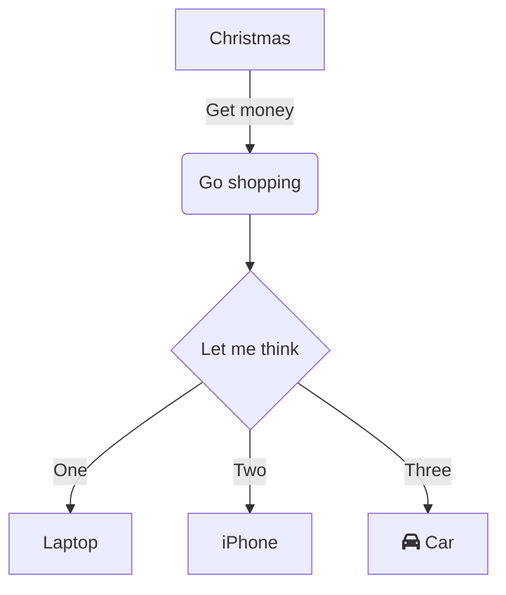

# NET-PRACTICE
*This project has been created as part of the 42 curriculum by `abetemps`*

# Content
* [📖 Description](#-description)
* [📜 Instructions](#-instructions)
   * [Install and run the training interface](#install-and-run-the-training-interface)
   * [Export configurations](#export-configurations)
   * [Submission requirements](#submission-requirements)
* [📚 Resources](#-resources)
   * [TCP/IP Addressing](#tcpip-addressing)
   * [Subnet Masks](#subnet-masks)
   * [Default Gateway](#default-gateway)
   * [Routers and Switches](#routers-and-switches)
      * [Routers](#routers)
      * [Switches](#switches)
   * [OSI Layers](#osi-layers)
* [📥 Submission details](#-submission-details)

# 📖 Description

***
# 📜 Instructions

## Install and run the training interface
```
wget https://cdn.intra.42.fr/document/document/45519/net_practice.1.9.tgz && tar -xf net_practice.1.9.tgz && cd net_practice && ./run.sh
```

## Export configurations

## Submission requirements

***
# 📚 Resources
## TCP/IP Addressing
## Subnet Masks
## Default Gateway
## Routers and Switches
### Routers
### Switches
## OSI Layers



***
# 📥 Submission details
- level1.json
- level2.json
- level3.json
- level4.json
- level5.json
- level6.json
- level7.json
- level8.json
- level9.json
- level10.json
